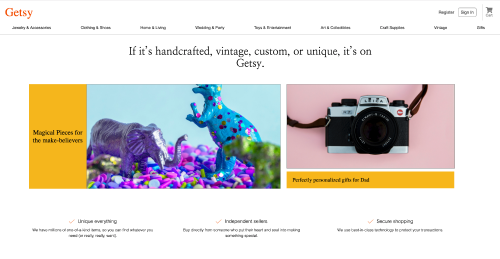

# Getsy

Getsy is a clone of Etsy, an e-commerce application where users can sell handmade or vintage products. 

---

</br>

<p align="center">
    
</p>

</br>

## Technologies

-   Node.js - backend api
-   Express
-   MongoDb - non-relational database
-   React-Redux - static page frontend routing
-   AWS / S3 integration for hosting images

* For a live example, please visit the app hosted on heroku: 
https://getsy-app.herokuapp.com/


## Features

1. User-Auth
    * User authentication using axios and jwt-decode
    * Login / Logout / Sign up
  
2. Product Listing
    * Listing creation 
    * Listing edit 
    * Listing deletion
    * Product image
        * Images are hosted on AWS
        * User is able to upload a product image on listing creation


</br>

<p align="center">
    
</p>

</br>

## AWS / S3 
AWS configuration for connecting app to AWS and S3 for image hosting.
A user is able to upload an image on listing creation.

## Modal / Hidden components
Several different methods of rendering modals or hidden components used throughout the app.
Some were rendered by implementing a Modals class, and others made use of CSS to hide/display elements.

</br>

<p align="center">
    
</p>

</br>

Modal class example:
```javascript 
let component;
switch (modal) {
  case 'login':
    component = <LoginFormContainer />;
    break;
  case 'signup':
    component = <SignupFormContainer />;
  break;
    default:
  return null;
}
  
let modalComponent; 
  if (modal === 'signup' || modal === 'login') {
    modalComponent = 
    <div className="modal-background" onClick={closeModal}>
      < div className="modal-child" onClick={e => e.stopPropagation()} >
        {component}
      </div>
    </div>
  } 
  return (
    <div>
      {modalComponent}
    </div>
  )
}
```

CSS example:
```javascript 
renderProductForm() {
      if (this.state.createClicked === "product-form") {
        this.setState({
          createClicked: "hidden"
        })
      } else {
        this.setState({
          createClicked: "product-form"
        })
      }
    }
    
render() {
  return (
          <div className="outer-profile-container">
           ....
              <button
                onClick={this.renderProductForm}
                className="create-product-btn">
                Create a product
              </button>
            <div
              id="products-and-reviews"
              className={this.state.createClicked}>
              <ProductForm />
            </div>
          </div>
        );
}
```

## Future Features

1. Shopping Cart
2. Reviews
3. User profile

### credits:
Photos from Unsplash: 
Markus Spiske, Pao Edu, Samantha Gades, Heather Barnes, Alina Karpenko, Bartosz Sujkowski, Kelly Sikkema, Pawel Czerwinski, Freddy G, Phoenix Han

Photos from Pexels:
rawpixel, Torsten Dettlaf, Kaboompics, Tim Durben
